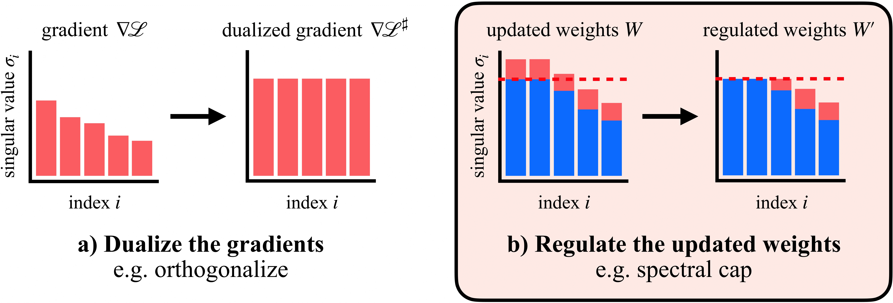

# Training transformers with enforced Lipschitz constants



[Paper](https://arxiv.org/abs/2507.13338)
| [Data](https://huggingface.co/phess2/lipschitz-transformers)
| [X](https://x.com/LakerNewhouse/status/1946646237262090434)

What if large scale transformer training could be free of loss spikes? Is there a better way than weight decay?

A Lipschitz bound controls how sensitive a network is to input or weight changes. By controlling it, we can stabilize training by preventing exploding attention logits, set adversarial robustness bounds in advance, and possibly create models more compatible with low precision inference.

We compare pairs of [optimizer, weight constraint method] across AdamW / Muon and existing constraint methods / our proposed methods _spectral cap_ and _spectral hammer_. We find that Muon improves weight constraint methods across the board in the Lipschitz vs. performance tradeoff. And we show that it is possible to train a 145M parameter NanoGPT to competitive accuracy with entirely constrained weights.

As always, there is a lot of work left to train models faster and more scalably (e.g., with Lipschitz guarantees). This repo has a setup to reproduce our results, or train your own Lipschitz-constrained models. Our data is also available on [Huggingface](https://huggingface.co/phess2/lipschitz-transformers).

## Setup

1. `git clone https://github.com/Arongil/lipschitz-transformers`
2. `python -m venv lipschitz`
3. `source lipschitz/bin/activate`
4. `pip install -e .`

## Train a Lipschitz-enforced transformer

All three examples are available in `experiment.ipynb`. Just change the config you select, and run. Any of the examples in our paper are reproducible here, or you can try your own settings or your own constraint methods.

Warmup #1: MLP on CIFAR-10, unconstrained (baseline)

Warmup #2: MLP on CIFAR-10, constrained (ours)

Warmup #3: Shakespeare transformer with 2M parameters

To run the Shakespeare transformer from a checkpoint (or check out some of our checkpoints on [Huggingface](https://huggingface.co/phess2/lipschitz-transformers)), use `run_checkpoint.py`.

Note: the polynomial coefficients used to implement hard cap in this repo were derived in March/April, before Leloy Kun and Jianlin Su had invented the formula for hard cap involving msign [[1](https://leloykun.github.io/ponder/spectral-clipping), [2](https://www.lakernewhouse.com/writing/muon-3)]. We're keeping the coefficients for reproducibility, but it'd be great to experiment with the recent more exact formulas!

## Ellipsotope-Budgeted Clipping (EBC)

EBC enforces a per-step trust region in logit space by clipping the global update using a budget that sums per-layer sensitivities times update norms. It uses:

- A KL-derived target per token `delta` to compute a logit bound `tau = sqrt(4 * tokens * delta)`.
- JVP-based estimates of layer sensitivities `beta_l = ||J_l @ U_l||` along the actual update direction, updated every N steps for K layers with EMA smoothing.
- L1 aggregation across layers and RMS norms of updates by default.

Enable EBC via config (defaults shown below):

```
{
  "ebc_enable": true,
  "ebc_target_kl": 0.05,           // nats/token
  "ebc_update_every": 20,          // steps between beta updates
  "ebc_probe_layers": 2,           // layers to probe each update
  "ebc_beta_ema": 0.9,             // EMA smoothing for beta
  "ebc_safety": 1.05,              // conservative multiplier on beta
  "ebc_aggregate": "l1",          // or "l2"
  "ebc_center_logits": true,       // per-token centering
  "ebc_include_embed_out": false   // exclude embed/out from budget
}
```

When enabled, EBC integrates transparently in `Trainer` before weight decay/projection, and logs internal state (`tau`, `S`, `c`) at training log intervals.

### Minimal ablation runner

For a quick comparison over small synthetic LM data (no downloads), use:

```
python -m scripts.ablate_ebc
```

This sweeps a small grid over optimizer × EBC × spectral (Adam/Muon × off/on × off/on) on a toy GPT and prints a CSV line per run:

```
optimizer,ebc,spectral,final_loss,final_acc,ebc_c
adam,0,0, ...
adam,1,0, ...
muon,0,1, ...
muon,1,1, ...
```

For real datasets (Shakespeare/FineWeb), enable EBC in your sweep configs and run via `main.py` as usual.

### Shakespeare ablation (GPU‑friendly)

Run a small grid over optimizer × spectral × EBC on Shakespeare with logging and figures:

```
python -m scripts.run_shakespeare_ebc_ablation \
  --steps 2000 --batch_size 64 --seq_len 256 \
  --num_blocks 3 --d_embed 128 --num_heads 4 \
  --optimizers adam,muon --spectral none,spec --ebc off,on \
  --deltas 0.05,0.1 --aggregates l1
```

Outputs are saved under `outputs/ebc_ablation/<timestamp>/`:
- `summary.csv` and `results.json` with metrics (wall‑clock, val loss/acc/PPL, accept‑rate, avg clip)
- Per‑run loss and clip curves: `<optimizer>_<spectral>_baseline_*` and `..._ebc_d<δ>_<agg>_*`
- A simple Pareto figure `pareto_ppl_vs_avgc.png` (val PPL vs average clip factor)

Notes:
- The ablation uses `jit=False` by default to avoid stateful Rope cache issues under JIT. For stable configs or after refactoring Rope caching, you can enable JIT via config in your own scripts.
- Internet access is required once to fetch Shakespeare data; subsequent runs use the local cache.

### The real deal: 145M parameter NanoGPT

The [modded NanoGPT](https://github.com/KellerJordan/modded-nanogpt) repo by Keller Jordan has a wonderful script that trains a GPT-2 small scale transformer in under 3 minutes on an 8xH100. We modified the script to enforce Lipschitz constraints. You can run the script with `/nanogpt/run.sh` -- see the subdirectory's README for setup instructions. There's a default spectral cap example, plus a spectral normalization example.

## Acknowledgments

Thank you to Lambda Labs and Rami Seid for supporting the work with compute credits!

## Citation

```bibtex
@article{newhouse2025lipschitztransformers,
  title={Training Transformers with Enforced Lipschitz Constants},
  author={Laker Newhouse, R. Preston Hess, Franz Cesista, Andrii Zahorodnii, Jeremy Bernstein, Phillip Isola},
  journal={arxiv:2507.13338},
  year={2025}
}
```
